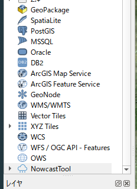
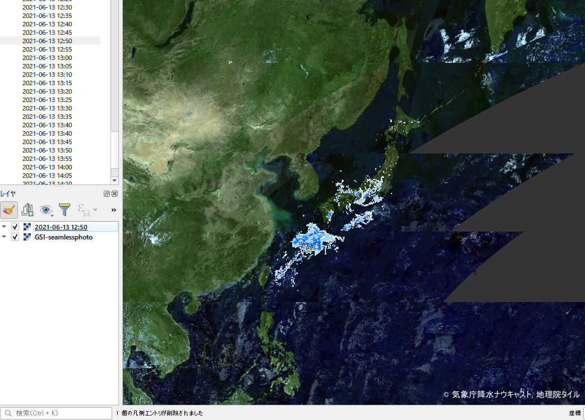
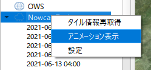
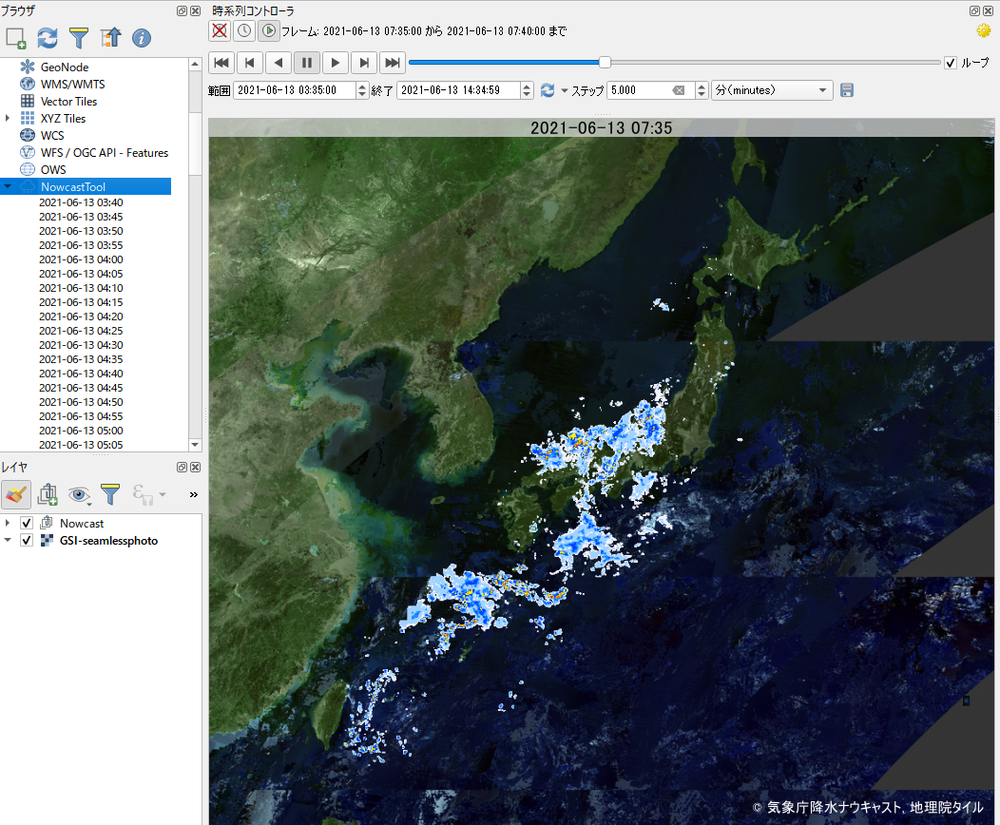
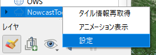
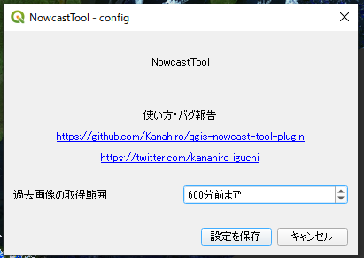

# NowcastTool - 降水ナウキャストQGISプラグイン

気象庁が公開する降水ナウキャストは、過去の降水量および1時間先までの予報です。データ形式はXYZタイルですが、時点ごとに別のURLが振られるため時系列表示が容易ではありません。

このQGISプラグインを使えば、各時点のタイルの表示やアニメーション表示を簡単にできるようになります。冒頭のGIFアニメはこのプラグインを活用して作ったアニメーションです。

## 注意

- 非公式のソフトウェアです、このプログラムに関してデータ配信元である気象庁様に問い合わせはしないでください
- タイル画像の配信方式などは予期せずして変更される可能性があり、その場合このプラグインは使えなくなります

## 使い方

プラグインをインストールすると、ブラウザに``NowcastTool``という雨雲アイコンの項目が追加されます。

QGIS起動時に自動で気象庁が配信しているナウキャストの時系列情報を取得し、``NowcastTool``以下にアイテムが追加されます。取得する時間範囲は、デフォルトで3時間前～1時間後です。過去データの取得範囲は変更可能です（後述）。

### 1時点のタイルをマップに表示

各時点のアイテムをダブルクリックもしくは右クリック「マップに追加」とすると、地図画面に表示されます。

### アニメーション表示

``NowcastTool``以下に存在する全時点のタイルを、QGIS3.14以降の基本機能である``TemporalController``でアニメーション表示が行えるよう設定したうえで、マップへ追加します。

ブラウザの``NowcastTool``を右クリックして``アニメーション表示``をクリックして実行します。

> TemporalControllerの使い方の説明は割愛します
[https://www.youtube.com/watch?v=-feo9urzCj4&t=119s](https://www.youtube.com/watch?v=-feo9urzCj4&t=119s)などを参照してください。

### 過去データの取得範囲設定

ブラウザの``NowcastTool``を右クリック、``設定``をクリックして設定画面を開きます。

5分刻みで``1200分前～180分前``まで指定することができます。上限の1200分に特に意味はないので、要望などがあれば見直します。